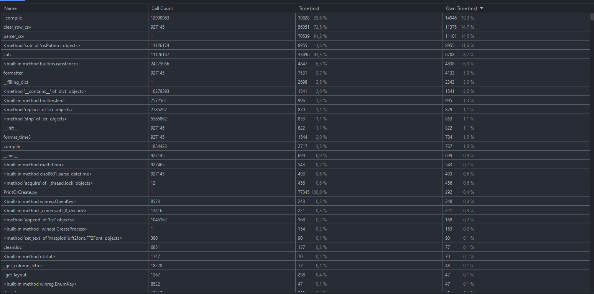
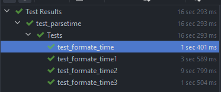
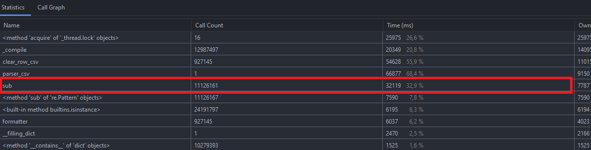
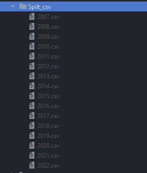
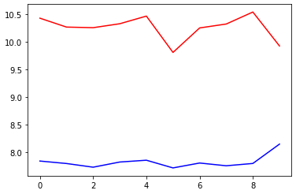
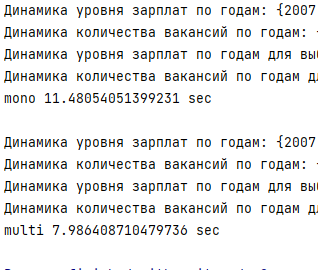

# Основной файл это PrintOrCreate.py
 
## Тесты

## Оптимизация

#### Проверял скорость методов через тесты

#### Но они оказальст мало эфективными
#### Gровел тесты через основной код
#### strip = 63.91 сек
#### простое заполнение = 49.32 сек
#### isoparse = 64.43 сек
#### ciso8601 = 39.46 сек
#### Буду использовать библиотеку ciso8601
### Заметил, что regex работают медлено

#### заменил на собсвенный метод
### Итоговое время 19.24 сек

## Спилит CSV по годам 
#### SplitCSV.py

## Multiprocessing 
### Сделал 10 испытаний с замерами и построил график
#### Без многопроцессорной обработки - 10.26 сек
#### Multiprocessing - 7.82 сек
 